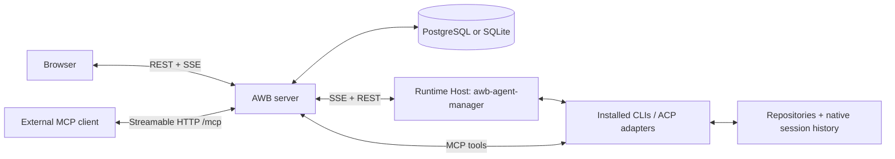

# AI Workflow Board (AWB)

**Run AI CLI sessions on your own machines, give agents a queue of work, and follow the results in one place.**

AWB is a self-hosted platform for working with AI agents. Start with a native CLI session, turn work into tickets when you need a queue and an audit trail, or give a larger mission to a team. The browser is your work interface; your **Runtime Hosts** run the CLIs and hold their native session history.

Each ticket has **one assignee**, a fixed status, tags, and an optional project. Ready tickets start automatically when that assignee has capacity. Agents use **MCP (Model Context Protocol)** to read instructions, report results, and update work. Despite the project name, there are no configurable board or column objects: Tickets offers a kanban view of fixed statuses and a list view.

Work pages combine the accounts you can access. **Accounts** govern ownership, membership, credentials, execution policy, and budgets; you do not need to switch workspaces to find your work.

## Contents

- [What you can do](#what-you-can-do)
- [How the pieces fit together](#how-the-pieces-fit-together)
- [Install the AWB server](#install-the-awb-server)
- [Connect your first Runtime Host](#connect-your-first-runtime-host)
- [Run your first session](#run-your-first-session)
- [Automate work with tickets and projects](#automate-work-with-tickets-and-projects)
- [Give a mission to a team](#give-a-mission-to-a-team)
- [Connect an external MCP client](#connect-an-external-mcp-client)
- [Configuration and operations](#configuration-and-operations)
- [Troubleshooting](#troubleshooting)
- [Development](#development)
- [Documentation](#documentation)

## What you can do

| Feature | What it is for |
| --- | --- |
| **Sessions** | Open, resume, and drive native Claude Code, Codex, OpenCode, and Hermes sessions from the browser on hosts that advertise support. Read streaming answers and tool calls, select model/config options, and answer permission requests and questions. |
| **Tickets** | Queue bounded work with acceptance criteria, one assignee, priorities, tags, prerequisites, comments, attachments, and checklist subtasks. Track it through `backlog → todo → in_progress → review → done`. |
| **Projects** | Register a Git repository, its branch and credential, instructions, default assignee, and main clone folder on each host. Ticket executions use separate worktrees. |
| **Teams & Missions** | Declare an orchestrator and member slots. The orchestrator plans steps and dependencies; AWB dispatches ready steps and records results. Optional graph mode adds conditions, bounded loops, and human confirmation. |
| **Chat** | Use direct or group conversations with users and runtime participants, mentions, attachments, and persistent conversations. |
| **Terminals** | Open a live shell on a Runtime Host through the browser. A terminal lasts as long as its process; it is not a stored CLI session. |
| **Actions, Functions & Schedules** | Save agent prompts as Actions, define typed operations as Functions, and schedule prompts or Actions using UTC cron or intervals. |
| **QA & Security** | Define reusable scenarios/profiles, run them manually or in scheduled batches, record evidence, and optionally file failure tickets. QA can rerun after a fix, including a deployment gate. |
| **Knowledge & Skills** | Store documents, images, and links as Resources; optionally enable vector search and repository ontology graphs. Publish versioned skills and assign snapshots to runtime identities. |
| **Voice** | Optionally configure speech input, read-aloud answers, notifications, and operator sessions. Speech engines are configured on the AWB server. |
| **Administration** | Manage account membership, credentials, API keys, host/CLI versions, execution usage, and logs. REST API documentation is available at `/api-docs`. |

Supported execution runtimes include Claude Code, Codex, DeepSeek, Antigravity, Pi, OpenCode, and Hermes. Features vary by runtime and the binaries/adapters installed on a host. The UI uses reported capabilities and model options. See [CLI modules](docs/cli-modules.md) and [runtime configuration](docs/agent-manager.md#runtime-selection-contract).

The work UI adapts to phones, tablets, and desktops. On smaller session screens, open **Settings** for runtime controls; the prompt fills its own row above the attachment/voice/send controls. Notifications can be muted from the top bar. See the [session guide](docs/agent-sessions.md#작은-화면에서-사용하기).

## How the pieces fit together



- **AWB server** stores work, ownership, configuration, and audit records, serves the React UI, and exposes REST, SSE, and MCP endpoints.
- **Runtime Host** is a machine running `awb-agent-manager`. It supervises CLI processes, handles sessions and terminals, and reports capabilities. It can be your laptop, workstation, or a server.
- **RuntimeSpec** declares where and how work runs: host, CLI, model, working folder, credentials, and runtime settings. Choose these in a ticket, chat, team slot, or automation form. You do not create an Agent database row first.
- **Agent templates** are optional reusable launch preferences managed in Hosts. Selecting one copies preferences into a form; the execution's own spec/folder remains independent.
- **Native session history** belongs to the CLI on its host. AWB stores ownership and execution settings, and retrieves history through the manager.

The server and a Runtime Host can run on the same machine. Installing the server gives you the UI and work management; connect a host with a configured CLI to execute AI work. CLI installation, provider login, and model usage billing are separate from AWB installation.

## Install the AWB server

| Route | Requirements | Browser URL |
| --- | --- | --- |
| **Docker Compose** | Docker with Compose, access to the repository and configured image | `http://localhost:7701` |
| **Run from source** | Git, Node.js **22.12+**, npm **11.6.1** | `http://localhost:7700` in development |

The source requirement covers the manager's Node 22 requirement and Vite's Node 22.12 minimum. The Dockerfile uses Node 22. Compose supplies PostgreSQL; local development uses SQLite through sql.js without a database service.

### Option A: Docker Compose

```bash
git clone https://github.com/parnmanas/ai-workflow-board.git
cd ai-workflow-board
cp docker-compose.env.example .env
```

Edit `.env` and replace `DB_PASS` with your own database password. Then start:

```bash
docker compose pull
docker compose up -d
docker compose ps
```

Open **http://localhost:7701**. The same server serves the UI, `/api/*`, `/mcp`, and `/api-docs`.

Compose runs PostgreSQL 16 and the AWB server. It persists the database in **`pgdata`** and server files, including the generated credential encryption key, in **`awbdata`**. It publishes ports **7701** and **5432**; adjust mappings if those ports are in use or the database should only be reachable inside Docker.

The supplied Compose file uses `ghcr.io/parnmanas/ai-workflow-board:latest`. Pulling that image does not build your checkout. To run the source you just cloned, build the image locally and start it without pulling over it:

```bash
docker build -t ghcr.io/parnmanas/ai-workflow-board:latest .
docker compose up -d --pull never
```

### Option B: Run from source

```bash
git clone https://github.com/parnmanas/ai-workflow-board.git
cd ai-workflow-board
npm ci --ignore-scripts
cp apps/server/.env.example apps/server/.env
```

The example uses SQLite and port 7701. No provider token or development authentication bypass is needed to open the UI and complete setup.

Start the server and client from the repository root:

```bash
npx turbo run dev --filter=server --filter=client
```

| Endpoint | URL |
| --- | --- |
| Web UI | http://localhost:7700 |
| REST API / health | http://localhost:7701/api/health |
| MCP | http://localhost:7701/mcp |
| REST API documentation | http://localhost:7701/api-docs |

Vite proxies `/api` and `/mcp` to NestJS. SQLite files are created under the repository's `database/` directory. Stop the process normally to flush pending writes.

You can also run `npm run dev:server` and `npm run dev:client` in separate terminals. The root `npm run dev` starts **all three workspaces**, including agent-manager, and its `predev` script clears ports 7700, 7701, and 7702. Use the filtered command above when you only want the web application.

### Complete initial setup

1. Open the UI. A fresh database shows the initial administrator setup form.
2. Enter your name, email, and a password of at least eight characters.
3. Sign in and open **Sessions**. A default ownership account named **Personal** is seeded automatically.
4. For additional users, registration creates a pending request. An administrator approves the user and grants membership and feature permissions.

Manage ownership under **Settings → Ownership** and membership under **Settings → Members**. Account membership and permission to operate hosts/sessions/terminals are separate checks. Sessions, terminals, and voice are administrator-only by default; administrators can grant the corresponding permissions.

## Connect your first Runtime Host

Do this on the machine where your repositories and AI CLI will run. For a Docker-hosted AWB server, the manager normally runs separately on the execution machine.

1. Install and sign in to the CLI you intend to use. Confirm it works as the OS user who will run the manager. Install Git for repository worktrees.
2. In AWB, open **Hosts** (`/hosts`) → **Runtime Hosts** and create a token with **Pair manager…**. The token/display code is single-use and expires after ten minutes.
3. On the execution machine, install and pair the manager:

   ```bash
   npm i -g --ignore-scripts awb-agent-manager
   awb-agent-manager setup
   ```

   Enter the **server base URL** and token. On the same machine, use `http://localhost:7701`; on another machine, use the server's reachable hostname or HTTPS URL. Enter the base URL without `/mcp`. The manager can drive several CLIs; setup does not ask you to choose one.

4. Start it in the foreground to check the connection:

   ```bash
   awb-agent-manager
   ```

5. Confirm the host appears online and its CLI/session capabilities are available. After a successful connection, stop the foreground process and optionally install it as a service:

   ```bash
   awb-agent-manager service install
   ```

The manager stores pairing configuration in its platform configuration directory (`~/.config/awb-agent-manager/` on Linux by default). Keep it private: it contains the host API key. A paired host can execute authorized work across accounts; its pairing account is not a workspace switch.

For Linux, macOS, Windows, or Synology services, configuration overrides, and updates, see the [manager quickstart](apps/agent-manager/README.md) and [Runtime Host reference](docs/agent-manager.md).

## Run your first session

1. Open **Sessions** and choose **New session**.
2. Select an online host, an available CLI, and an absolute working folder **on that host**. Select a model and other options if the host reports them.
3. Send a small request, such as “Explain this repository and tell me how to run its checks.”
4. Follow the streamed transcript and tool cards. Answer permission requests or questions shown in the session.
5. Reopen it later from its host/CLI list. Existing native CLI sessions on the host can also appear there.

For a new session, AWB uses the applicable account/host/CLI defaults. The first open pins its owner, credential, configuration, and backend. Changing account defaults later does not silently change an existing session; explicit changes in that session are retained on resume.

Without an AWB credential binding, sessions use the host's CLI login. With a binding, the manager prepares a separate CLI home; it does not overwrite the operator's login files. History remains on the host. See [Agent Sessions](docs/agent-sessions.md).

## Automate work with tickets and projects

Use tickets for work with a clear outcome, queue position, and durable result.

### Register a project for repository work

1. Open **Projects** and add the repository URL, default branch, and Git credential if needed.
2. Add project instructions: install/build/test commands, conventions, and what a finished change should include.
3. Register the **main clone folder for each host** that will work on it. Use an absolute path to a prepared checkout on that machine; a host-folder entry records a path, it does not clone the repository for you.
4. Optionally set a default assignee and choose pull-request or direct-merge behavior.

A Project represents one repository. Resources hold documents, images, and links. With a registered host folder, ticket execution creates a worktree under `<main-clone>/.awb/wt/<ticket8>`; the main clone is not reset or cleaned. Without one, the manager uses its base-repository preparation path. See [Tickets & Projects](docs/tickets.md).

### Create and run a ticket

1. Open **Tickets** → create a ticket with a title, instructions, and acceptance criteria.
2. Select a Project, tags, priority, and **one assignee**: host + CLI + model + working folder/runtime settings. A project default assignee can supply this selection.
3. Use **`backlog`** while preparing it; move it to **`todo`** when ready.
4. When capacity is available, AWB moves it to **`in_progress`** and dispatches it. The agent reads the ticket via MCP, performs the work, and records results in comments.
5. The agent moves it to **`review`** for human inspection or **`done`** when complete. Move a reviewed ticket back to `todo` to request another pass.

| Status | What happens |
| --- | --- |
| `backlog` | Stored, not queued for execution. |
| `todo` | Queued; starts when its assignee has capacity. |
| `in_progress` | Active. Human comments and resolved waits can resume it. |
| `review` | Waiting for human review; not dispatched. |
| `done` | Complete. Completion hooks and dependent work can proceed. |

The default capacity is one active, non-pending ticket per runtime identity in an account. Queued work is ordered by priority, position, and creation time. Unassigned, pending, archived, and confirmed duplicate tickets do not start. Checklist subtasks are handled by their parent ticket's assignee and are not independently dispatched.

Use **pend** for an operator decision, prerequisites for other tickets, or CI waits for build results. Account settings can pause dispatch or change capacity. Completion can release dependent work, queue a `next_ticket`, invoke on-done Actions, and trigger an opted-in QA rerun.

## Give a mission to a team

1. Open **Teams** and declare an orchestrator plus member slots. Each slot selects a host, CLI, model, working folder, capabilities, and settings.
2. Use `shared` folders for a prepared common tree, or `isolated` for a separate provisioned folder/checkout per step. Shared is the default; coordinate simultaneous edits through dependencies.
3. Open **Missions**, create an objective with context and acceptance criteria, select the team, optionally select a Project, and start.
4. The orchestrator submits a step plan. AWB dispatches ready steps within mission limits, records evidence, and wakes the orchestrator when its judgment is needed.
5. Review questions, confirmations, output, and the timeline. The orchestrator explicitly completes the mission; an operator can cancel it.

Ownership follows the selected account-owned team/project. Global-team standalone work uses the default accessible account. Teams coordinate durable missions; runtime-native subagents perform bounded execution within an agent's work. See [Orchestration](docs/orchestration.md).

## Connect an external MCP client

For browser-launched managed work, agent-manager prepares the MCP connection. You can also connect an existing MCP client directly for tool access.

1. Open **Settings → API Keys** and create a key with the account/scope you need.
2. Copy it when shown; the raw value is only displayed once.
3. Configure **Streamable HTTP** with the `/mcp` URL and `Authorization: Bearer <key>`.

For a client accepting Claude-style `mcpServers` JSON:

```json
{
  "mcpServers": {
    "awb": {
      "type": "http",
      "url": "http://localhost:7701/mcp",
      "headers": {
        "Authorization": "Bearer YOUR_AWB_API_KEY"
      }
    }
  }
}
```

Use your deployed HTTPS URL remotely. Configuration format and file location depend on the client. A direct MCP connection provides tools; it does not by itself make that client a Runtime Host receiving the execution queue.

Discover current tools through MCP `tools/list`. Categories cover accounts, tickets, projects, comments, chat, resources, QA/Security, Actions/Functions/Schedules, missions/steps, skills, builds, deployments, and ontology queries. Canonical names include `list_accounts`, `create_ticket`, `move_ticket`, `save_project`, and `create_automation_schedule`. Registration lives in [tools/index.ts](apps/server/src/modules/mcp/tools/index.ts); `/api-docs` describes REST, not MCP JSON-RPC.

For development, `npm run mcp` starts standalone stdio and `npm run mcp:http` starts separate HTTP on **7702** by default. Prefer integrated `/mcp` when the web server is running. With SQLite, do not run separate server processes against the same file; give standalone processes their own absolute `SQLJS_DB_PATH` and `SQLJS_ONTOLOGY_DB_PATH`, or use PostgreSQL.

## Configuration and operations

### Environment files

Source npm scripts run the backend in `apps/server`, where `dotenv/config` loads **`apps/server/.env`**. Compose reads the repository-root **`.env`** for substitutions in `docker-compose.yml`. Adding a variable to Compose's `.env` only reaches a container when the service forwards it.

| Variable | Default / behavior |
| --- | --- |
| `PORT` | `7701` for the AWB server. |
| `NODE_ENV` | Set `development` locally and `production` when deploying. |
| `DB_TYPE` | `sqlite` locally; Compose sets `postgres`. These are the supported development/production paths. |
| `DB_HOST`, `DB_PORT` | PostgreSQL host/port (`localhost`, `5432` outside Compose; `db` inside it). |
| `DB_NAME`, `DB_USER`, `DB_PASS` | Database name, user, password. Compose requires `DB_PASS`. |
| `AWB_DATA_DIR` | Server file storage. Docker sets `/app/data` and persists it in `awbdata`. |
| `ENCRYPTION_KEY` | Optional stable secret for credential encryption. If absent, a key file is generated under the server data directory. Preserve the secret or that file. |
| `CORS_ORIGIN` | Explicit allowed origin for cross-origin browser access. Development reflects origins when unset; production rejects cross-origin requests when unset. Same-origin UI/API deployment works without it. |
| `MCP_API_KEYS` | Legacy/environment MCP keys (`name:key,name2:key2` or comma-separated keys). UI-managed keys are preferred. |
| `AGENT_API_KEY` | Legacy/environment shared agent key. Host pairing issues a managed key instead. |
| `MCP_DEV_MODE` | Optional local bypass: only outside production and when no active DB/environment MCP keys exist. Defaults to no bypass. |
| `AGENT_DEV_MODE` | Optional local agent-API bypass: only outside production and when `AGENT_API_KEY` is absent. Defaults to no bypass. |
| `SQLJS_DB_PATH`, `SQLJS_ONTOLOGY_DB_PATH` | Override SQLite file paths. Absolute paths avoid ambiguity; relative values resolve under `database/`. |
| `AWB_DB_AUTORECOVER` | `1` backs up a corrupt local sql.js file and recreates an empty one on startup. |

To forward a custom origin with Compose, for example, add `compose.override.yaml`:

```yaml
services:
  server:
    environment:
      CORS_ORIGIN: https://awb.example.com
```

Embeddings use `EMBEDDING_PROVIDER=openai`, `OPENAI_API_KEY`, and optionally `EMBEDDING_MODEL` (default `text-embedding-3-small`), or their System Settings equivalents. Voice needs configured STT/TTS engines; see [Voice](docs/voice-operator.md). QA and Security schedules have separate controls in their [scheduler references](docs/README.md#automation-and-quality).

### Updates and backups

Before upgrading, back up **both the database and the credential encryption key/data volume**. The current server runs TypeORM schema synchronization in production and development, followed by data migrations. Recent board/Agent removal migrations are destructive; rollback requires a backup. See the [ownership migration runbook](docs/runbooks/account-ownership-migration.md).

For a Compose database backup:

```bash
docker compose exec -T db sh -c 'pg_dump -U "$POSTGRES_USER" "$POSTGRES_DB"' > awb-backup.sql
```

Back up `awbdata` separately, or preserve your configured `ENCRYPTION_KEY`. A database backup cannot recover encrypted credentials if their key is lost. For SQLite, stop the writer before copying `database/data.db` and `database/ontology.db`, and preserve the server data directory too. Native CLI history and repositories need host-side backups.

To update Compose after making backups:

```bash
docker compose pull
docker compose up -d
docker compose logs --tail=100 server
```

For a source deployment, update your checkout, reinstall from the lockfile, run `npm run build`, and restart `npm start` with production/PostgreSQL configuration. The built server serves `apps/client/dist` on port 7701. Merging into `main` alone does not update another user's deployment; this repository does not include a general server auto-deployment workflow.

agent-manager releases independently through the [npm workflow](.github/workflows/publish-agent-manager.yml). Versions are computed at publish time; do not manually bump its source package version. Hosts report running and installed versions separately; an installed update may need a restart. See [release procedure](docs/runbooks/agent-manager-release.md) and [self-update policy](docs/agent-manager.md#self-update-policy).

### Network and access

Use HTTPS for remote browser access. Reverse proxies must allow long-lived SSE for `/api/events/stream` and MCP streaming; response buffering or short idle timeouts interrupt live sessions. Microphone input requires a browser secure context (HTTPS or localhost).

Passwords are hashed with bcryptjs; stored credentials use AES-256-GCM; managed API keys are hashed and displayed once. Feature permissions and account membership determine access. A browser terminal acts as the manager's OS user, so grant `terminals.use` only to users who should operate that machine.

## Troubleshooting

| Symptom | Check |
| --- | --- |
| **UI opens, but no sessions/hosts appear** | Pair/start agent-manager. Confirm a supported CLI is installed and usable by the service's OS user; a service may have a different PATH from your shell. |
| **Pairing fails** | Use the server base URL, a fresh token, and a reachable hostname. `localhost` points to the execution machine itself. Tokens expire after ten minutes. |
| **A ticket stays in `todo`** | Check assignee, host connectivity, dispatch pause, pending/prerequisite/CI flags, and capacity. Unassigned and checklist-child tickets do not dispatch. |
| **MCP returns 401/403** | Use an active key with the required scope and owner access. `MCP_DEV_MODE` does not bypass production authentication or active keys. |
| **Session/terminal/voice access is denied** | Check feature permissions as well as membership. These features are admin-only by default. |
| **Models are missing** | Refresh through the UI's host/model controls. The model service prefers ACP reports, then saved ACP configuration, then the heartbeat list. |
| **Credential cannot be decrypted after an update** | Restore the original encryption secret/key file and volume. Do not regenerate a key for an existing credential database. |
| **An old browser tab fails to load a chunk** | Reload after deployment; the tab may reference an earlier build's assets. |
| **A shell disappears from Terminals** | Only live processes are listed. Create a new terminal after exit; native CLI sessions have a separate history/resume lifecycle. |

For a corrupt local sql.js database, startup reports the failing path. Preserve the file for recovery first. If an empty database is acceptable, automatic recovery backs up the corrupt file and creates a fresh one:

```bash
AWB_DB_AUTORECOVER=1 npm run dev:server
```

This loses the active contents of the recreated database; restore a known-good backup when you need the data. To try separate fresh files:

```bash
SQLJS_DB_PATH=/absolute/path/data-fresh.db \
SQLJS_ONTOLOGY_DB_PATH=/absolute/path/ontology-fresh.db \
npm run dev:server
```

The guard only applies to local sql.js files; it does not replace a PostgreSQL database. See [host troubleshooting](docs/agent-manager.md#troubleshooting) for CLI/update problems.

## Development

### Repository layout

```text
apps/client/           React UI, Vite, browser/client tests
apps/server/           NestJS API, MCP tools, entities, migrations, server tests
apps/agent-manager/    Host runner, CLI/ACP adapters, sessions, terminals, npm package
services/voice-server/ Optional self-hosted speech service
skills/                Built-in versioned skill pack
docs/                  Feature contracts, architecture, operational runbooks
scripts/               Development and CI helpers
database/              Local SQLite files (generated at runtime)
```

### Commands from the repository root

| Command | Purpose |
| --- | --- |
| `npm ci --ignore-scripts` | Install the lockfile-resolved workspaces. |
| `npx turbo run dev --filter=server --filter=client` | Run the web app without the host manager. |
| `npm run dev:server` / `npm run dev:client` | Run one web workspace. |
| `npm run dev:agent-manager` | Run the local manager in watch mode; pair it first. |
| `npm run dev` | Clear development ports, then run all three workspaces. |
| `npm run build` | Build client, server, and manager through Turbo. |
| `npm start` | Start the already-built server; does not build automatically. |
| `npm run mcp` / `npm run mcp:http` | Standalone MCP over stdio / HTTP. |
| `npm test -w server` | Build and run registered server test suites. |
| `npm test -w client` | Run client logic and DOM interaction tests. |
| `npm run test:e2e:responsive -w client` | Check work pages, dialogs, session input, and viewport changes in Chromium. |
| `npm test -w awb-agent-manager` | Build and run manager tests. |
| `npm run test:qa -w server` | Run server QA flows. |
| `npm run test:qa:pg -w server` | Run PostgreSQL QA with a configured test database. |

There is no root `npm test` script. Suites are defined in each workspace; PostgreSQL concurrency/dialect checks complement sql.js tests. See [server QA tests](apps/server/test/qa-flows/README.md) and [client tests](apps/client/test/README.md).

The stack is React 18, React Router 7, **Vite 8**, NestJS 11, Express 5, TypeORM 0.3, TypeScript, Zod, the MCP SDK, and Turbo. Workspace manifests and `package-lock.json` give exact resolved versions.

Read [AGENTS.md](AGENTS.md), [ownership](docs/ownership.md), and the relevant feature contract before changing implementation. Ticket writes go through `TicketService`, dispatch through `TicketDispatchService`, and models through `HostModelsService`/`useHostModels`. Server/manager wire changes belong together; see [CLI wiring](docs/runbooks/cli-module-wiring.md) and [MCP wiring](docs/runbooks/mcp-tool-wiring.md).

## Documentation

The [documentation index](docs/README.md) distinguishes current guides from historical designs/audits.

| Topic | Guide |
| --- | --- |
| Ownership and membership | [Ownership](docs/ownership.md) · [Catalog scopes](docs/catalog-scopes.md) |
| Native CLI sessions | [Agent Sessions](docs/agent-sessions.md) |
| Queue, status, projects, REST/MCP | [Tickets & Projects](docs/tickets.md) |
| Host installation/operations | [Manager quickstart](apps/agent-manager/README.md) · [Host reference](docs/agent-manager.md) |
| Teams and execution graphs | [Orchestration](docs/orchestration.md) |
| Automation | [Functions](docs/functions.md) · [Schedules](docs/automation-schedules.md) · [On-done Actions](docs/on-ticket-done-action-hook.md) |
| QA and Security | [QA scenarios](docs/qa-scenarios.md) · [QA drivers](docs/qa-driver-guide.md) · [Security scheduler](docs/security-scheduler.md) |
| Shell and speech | [Terminals](docs/terminals.md) · [Voice operator](docs/voice-operator.md) |
| Runtime extensions and skills | [CLI modules](docs/cli-modules.md) · [Runtime plugins](docs/agent-runtime-plugin-guide.md) · [Skills](docs/skills.md) |
| Server architecture | [Module composition](docs/architecture/modules.md) |

Legacy `/ws/...` bookmarks and workspace owner fields/headers/tool names remain aliases. New integrations use `account_id`, `X-Account-Id`, account MCP tools, and automation schedule tools. Existing IDs and CLI home/history paths are preserved. Filesystem `workspace_folder` still means a working directory.

## License

All rights reserved for the main project. The separately distributed `awb-agent-manager` package includes its own [MIT license](apps/agent-manager/LICENSE).
